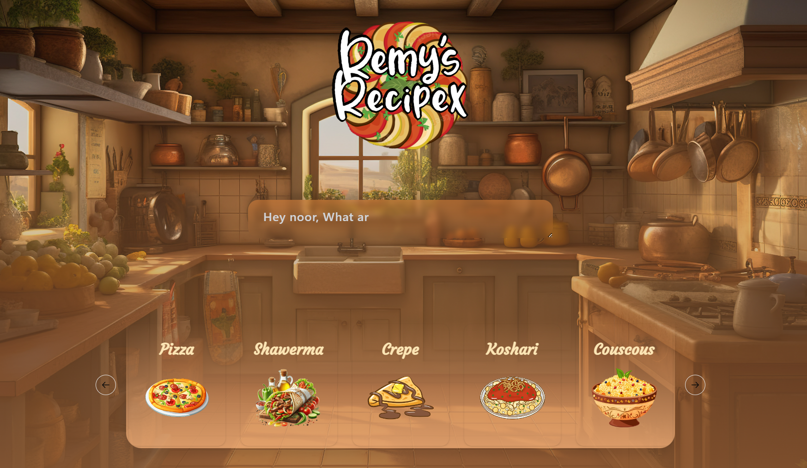
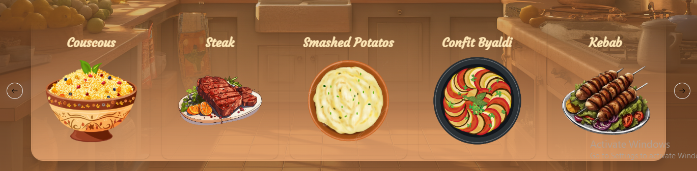
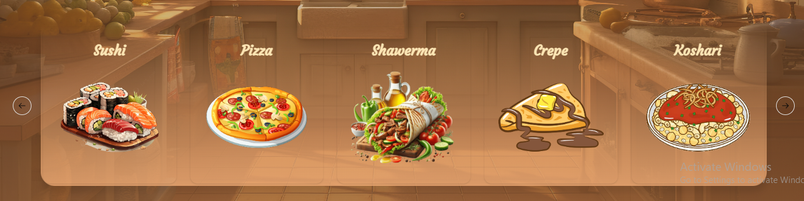
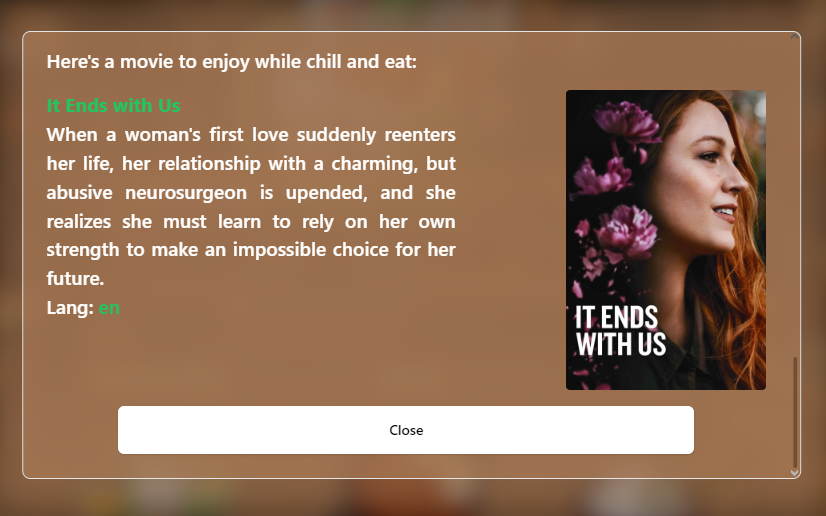
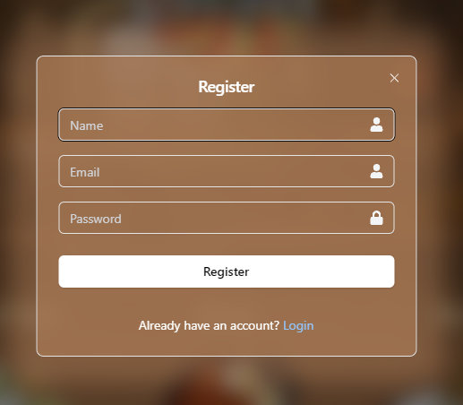
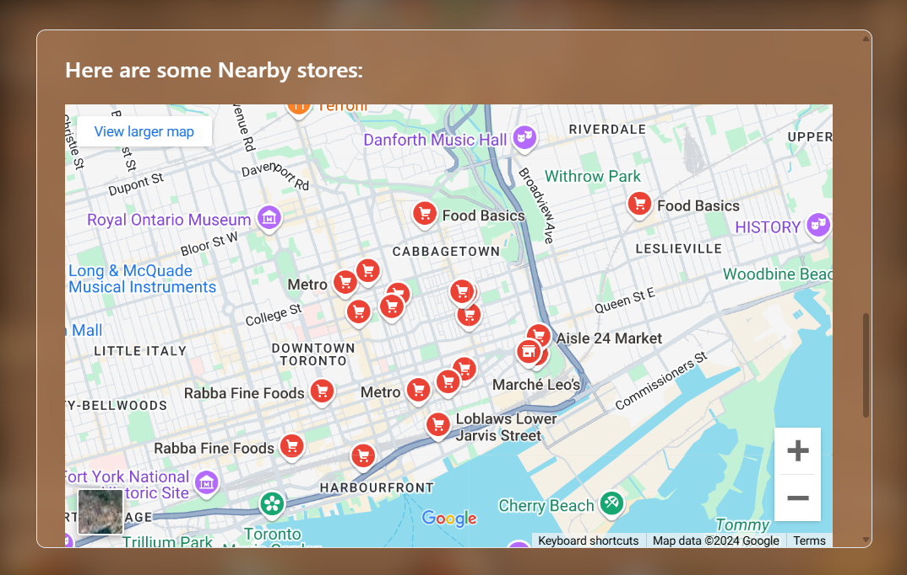

# RemyRecipeX


## Live

- [remyrecipes.up.railway.app](https://remyrecipes.up.railway.app/)  
- [remyrecipex.up.railway.app](https://remyrecipex.up.railway.app/) (backup)


## Screenshots







## Table of Contents

1. [Introduction](#introduction)
2. [Features](#features)
3. [Technology Stack](#technology-stack)
4. [Project Structure](#project-structure)
5. [Setup and Installation](#setup-and-installation)
6. [Running the Application](#running-the-application)
7. [API Endpoints](#api-endpoints)
9. [Database Schema](#database-schema)
10. [Configuration](#configuration)
11. [License](#license)

## Introduction

Got some extra food on hand but dont feel like throwing it away? or maybe you just cant decide on what you want to eat for a meal today, Our ol'Friend Remy is here to help!
Our WebApp is meant to help with food waste and helping people recycle their food instead of throwing excess food away, It would also provide with Places nearby to get any missing ingredients from the list it provides.
Feel like watching something while eating the meal? well we got you covered, with every recipe you get a movie suggestion to enjoy while eating, So what are you waiting for? get over here and try for yourself!

## Features

- User authentication (register, login, logout)
- Responsive design for various screen sizes
- Fast Recipe Generation.
- Movie Suggestions.
- Nearby Store Locating.

## Technology Stack

- Backend: Flask (Python)
- Database: MongoDB
- Frontend: React + vite + TS + Tailwindcss
- Authentication: Flask sessions
- WSGI Server: Gunicorn
- Web Server: Nginx (for production deployment)
- API Services: Gemini-Chat-API + OMDB(Open Movie DB)-API + GoogleMapsAPI

## Project Structure

```text
RemyRecipeX/
.
├── Client
│   ├── components.json
│   ├── dist
│   │   ├── assets
│   │   │   ├── Background-Bq1jNvTS.jpg
│   │   │   ├── LogoN-DntnNkqz.png
│   │   │   ├── index-Ds1_JCfB.css
│   │   │   ├── index-np7zopBB.js
│   │   │   ├── suggestion1-DQh46pk3.png
│   │   │   ├── suggestion10-BorAJkHO.png
│   │   │   ├── suggestion11-nD4MaWa7.png
│   │   │   ├── suggestion12-CoLSFW0W.png
│   │   │   ├── suggestion13-BD2CNVMu.png
│   │   │   ├── suggestion14-CAIsJVOw.png
│   │   │   ├── suggestion15-zIvGRDFL.png
│   │   │   ├── suggestion16-B-mwjjjG.png
│   │   │   ├── suggestion2-BXBfSqVr.png
│   │   │   ├── suggestion3-AOQt_3Mc.png
│   │   │   ├── suggestion4-DLNAoKFN.png
│   │   │   ├── suggestion5-XeveYIAI.png
│   │   │   ├── suggestion6-Db6iMs_w.png
│   │   │   ├── suggestion7-zaewGM4x.png
│   │   │   ├── suggestion8-9Cm8TdxB.png
│   │   │   ├── suggestion9-Bwlar1SB.png
│   │   │   └── text-DXJ1yRfP.png
│   │   ├── favicon.ico
│   │   ├── index.html
│   │   └── lottie
│   │       └── m12uodkj.lottie
│   ├── eslint.config.js
│   ├── index.html
│   ├── package-lock.json
│   ├── package.json
│   ├── postcss.config.js
│   ├── public
│   │   ├── favicon.ico
│   │   └── lottie
│   │       └── m12uodkj.lottie
│   ├── src
│   │   ├── App.tsx
│   │   ├── assets
│   │   │   ├── fonts
│   │   │   │   ├── Antreas.ttf
│   │   │   │   ├── CherryRustic.otf
│   │   │   │   ├── MyHeart.otf
│   │   │   │   ├── ShantellSans-VariableFont.ttf
│   │   │   │   ├── clockwise_light.ttf
│   │   │   │   └── the-servant.ttf
│   │   │   ├── images
│   │   │   │   ├── Background.jpg
│   │   │   │   ├── Logo.png
│   │   │   │   ├── LogoN.png
│   │   │   │   ├── suggestion1.png
│   │   │   │   ├── suggestion10.png
│   │   │   │   ├── suggestion11.png
│   │   │   │   ├── suggestion12.png
│   │   │   │   ├── suggestion13.png
│   │   │   │   ├── suggestion14.png
│   │   │   │   ├── suggestion15.png
│   │   │   │   ├── suggestion16.png
│   │   │   │   ├── suggestion2.png
│   │   │   │   ├── suggestion3.png
│   │   │   │   ├── suggestion4.png
│   │   │   │   ├── suggestion5.png
│   │   │   │   ├── suggestion6.png
│   │   │   │   ├── suggestion7.png
│   │   │   │   ├── suggestion8.png
│   │   │   │   ├── suggestion9.png
│   │   │   │   └── text.png
│   │   │   └── stylesheets
│   │   │       ├── Home.css
│   │   │       ├── Recipe.css
│   │   │       ├── Veffect.css
│   │   │       └── updatedHome.css
│   │   ├── components
│   │   │   ├── Crousel.tsx
│   │   │   ├── Home.tsx
│   │   │   ├── LoginModal.tsx
│   │   │   ├── RecipeModal.tsx
│   │   │   ├── RegisterModal.tsx
│   │   │   ├── Spinner.tsx
│   │   │   └── ui
│   │   │       ├── button.tsx
│   │   │       ├── card.tsx
│   │   │       ├── carousel.tsx
│   │   │       ├── dialog.tsx
│   │   │       ├── input.tsx
│   │   │       ├── sonner.tsx
│   │   │       └── textarea.tsx
│   │   ├── index.css
│   │   ├── lib
│   │   │   ├── types.ts
│   │   │   └── utils.ts
│   │   ├── main.tsx
│   │   ├── state
│   │   │   ├── dialogSlice.tsx
│   │   │   ├── responseSlice.tsx
│   │   │   └── store.ts
│   │   └── vite-env.d.ts
│   ├── tailwind.config.js
│   ├── tsconfig.app.json
│   ├── tsconfig.app.tsbuildinfo
│   ├── tsconfig.json
│   ├── tsconfig.node.json
│   ├── tsconfig.node.tsbuildinfo
│   └── vite.config.ts
├── Dockerfile
├── LICENSE
├── README.md
├── Server
│   ├── api
│   │   ├── __init__.py
│   │   └── routes
│   │       ├── __init__.py
│   │       ├── auth_routes.py
│   │       ├── gemi.py
│   │       ├── gpt_routes.py
│   │       ├── movie_routes.py
│   │       └── user_routes.py
│   ├── app.py
│   ├── config
│   │   ├── __init__.py
│   │   └── default.py
│   ├── database.py
│   ├── errors.py
│   ├── example-dotenv-file
│   ├── maps_test.html
│   ├── middleware.py
│   ├── models
│   │   ├── __init__.py
│   │   ├── auth.py
│   │   └── user.py
│   ├── requirements.txt
│   ├── static
│   │   ├── assets
│   │   │   ├── Background-Bq1jNvTS.jpg
│   │   │   ├── LogoN-DntnNkqz.png
│   │   │   ├── index-Ds1_JCfB.css
│   │   │   ├── index-np7zopBB.js
│   │   │   ├── suggestion1-DQh46pk3.png
│   │   │   ├── suggestion10-BorAJkHO.png
│   │   │   ├── suggestion11-nD4MaWa7.png
│   │   │   ├── suggestion12-CoLSFW0W.png
│   │   │   ├── suggestion13-BD2CNVMu.png
│   │   │   ├── suggestion14-CAIsJVOw.png
│   │   │   ├── suggestion15-zIvGRDFL.png
│   │   │   ├── suggestion16-B-mwjjjG.png
│   │   │   ├── suggestion2-BXBfSqVr.png
│   │   │   ├── suggestion3-AOQt_3Mc.png
│   │   │   ├── suggestion4-DLNAoKFN.png
│   │   │   ├── suggestion5-XeveYIAI.png
│   │   │   ├── suggestion6-Db6iMs_w.png
│   │   │   ├── suggestion7-zaewGM4x.png
│   │   │   ├── suggestion8-9Cm8TdxB.png
│   │   │   ├── suggestion9-Bwlar1SB.png
│   │   │   └── text-DXJ1yRfP.png
│   │   ├── favicon.ico
│   │   ├── index.html
│   │   └── lottie
│   │       └── m12uodkj.lottie
│   └── web_dynamic
│       ├── __init__.py
│       └── template_renderer.py
└── package-lock.json

24 directories, 140 files
```

## Setup and Installation

1. Clone the repository:
   ```sh
   git clone https://github.com/0x3mr/RemyRecipeX
   cd RemyRecipeX
   ```
2. Set up MongoDB:
   - Install MongoDB on your system

3. Set up environment variables:
   Create a `.env` file in the root directory to add your env variables. [example file](./Server/example-dotenv-file)

4. Docker build:
   ```sh
   docker build -t remyrecipex .
   ```


## Running the Application

```sh
docker run -p 5000:5000 remyrecipex
```

Enjoy :D
On port:5000 -Make sure this port is not already in use-

## API Endpoints

- POST `/api/gpt/ask`: get new recipe from leftovers
- POST `/api/gpt/recipe`: get new recipe from suggested
- GET  `/api/movie/ask`: get random cooking movie
- POST `/api/auth/register`: Register a new user
- POST `/api/auth/login`: User login
- GET `/api/auth/check-session`: Check Auth

## Database Schema

### User Collection

- `_id`: ObjectId
- `name`: String
- `email`: String
- `password`: String (hashed)
- `created_at`: Date


## Configuration

Configuration settings are managed in `config.py`. Different configurations are available for development, testing, and production environments.

## Authors

- Noor Amjad - [GitHub](https://github.com/Justxd22) / [Twitter](https://twitter.com/_xd222) / [LinkedIn](https://www.linkedin.com/in/noor-amjad-xd)
- Amr Abdelfattah - [GitHub](https://github.com/0x3mr) / [Twitter](https://twitter.com/an0n_amr) / [LinkedIn](https://www.linkedin.com/in/amrabdelfattah/)
- Ahmed Shalaby - [GitHub](https://github.com/Madiocre) / [Twitter](https://twitter.com/Ahmed_K_Shalaby) / [LinkedIn](https://www.linkedin.com/in/ahmed-shalaby-31a03a235/)
- Kedir Jabir - [GitHub](https://github.com/IbnuJabir) / [Twitter](https://x.com/Ibnu_J1) / [LinkedIn](https://www.linkedin.com/in/ibnu-jabir/)
- Ahmed Aboalesaad - [GitHub](https://github.com/Ahmed-Aboalasaad) / [Twitter](https://x.com/Aboalesaad_) / [LinkedIn](https://www.linkedin.com/in/ahmed-aboalesaad/)
- Abdelrahman Mohamed - [GitHub](https://github.com/hackerSa3edy) / [Twitter](https://x.com/hackersa3edy) / [LinkedIn](https://linkedin.com/abdelrahmanm0)


## License

Copyright (C) 2024
Licensed under the GPLv3 License
